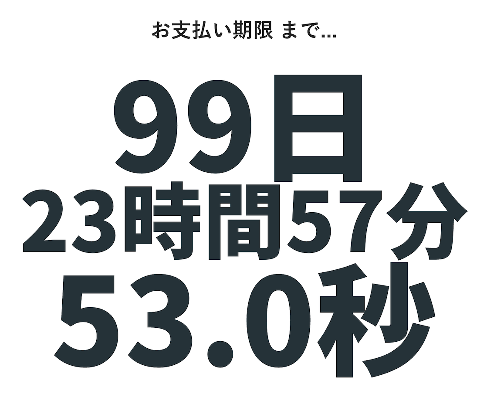
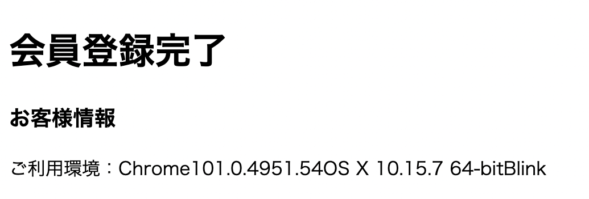
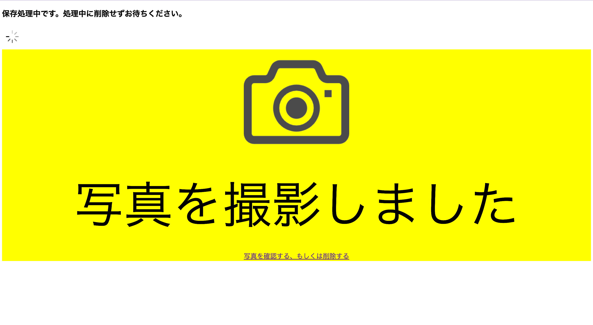

# ワンクリック詐欺サイト解剖してみた

<span class="author">hnm876_md</span>

## はじめに

こんにちは。古河中等教育学校６期生の張替健太です。
僕の記事の前に書かれた小難しそうな記事を見て、「プログラミング難しそうだな」とか「変態の領域なのかな」感じている人がいるかもしれません。
実際そうですが、Web プログラミングは意外と簡単です。
どれほど簡単なのか Web プログラミングの基本が詰まった教科書「ワンクリック詐欺サイト」を
見ながら体感していただければ幸いです。

## ワンクリック詐欺サイトってなあに

その名の通り、一見ありふれたボタンをクリックした途端に「会員登録完了」や「〇〇日までに料金を払ってね」などの脅しがたくさん出力される Web サイトのことです。
2018 年時点では存在していましたが、今でもあるんでしょうか。
もし引っかかっても、僕のように電話はかけずに無視してブラウザバックしましょう。

## ワンクリック詐欺サイト解剖

### 支払い期限タイマーの表示

{width=250}

こんな感じでクリックした人を焦らせて個人情報入力させようという魂胆です。
冷静に見てみるとおもちゃのような仕組みです。

```html:index.html
<div>
    <p><span id="hour"></span>hours</p>
    <p><span id="min"></span>minutes</p>
    <p><span id="sec"></span>seconds</p>
</div>
```

```js:timer.js
const hour = document.getElementById("hour");
const min = document.getElementById("min");
const sec = document.getElementById("sec");

function countdown(){
  const now = new Date(); //現在時刻を取得
  const tomorrow = new Date(now.getFullYear(),now.getMonth(),now.getDate()+1); //明日の0:00を取得
  const diff = tomorrow.getTime() - now.getTime(); //時間の差を取得（ミリ秒）

  //ミリ秒から単位を修正
  const calcHour = Math.floor(diff / 1000 / 60 / 60);
  const calcMin = Math.floor(diff / 1000 / 60) % 60;
  const calcSec = Math.floor(diff / 1000) % 60;

  //取得した時間を表示（2桁表示）
  hour.innerHTML = calcHour < 10 ? '0' + calcHour : calcHour;
  min.innerHTML = calcMin < 10 ? '0' + calcMin : calcMin;
  sec.innerHTML = calcSec < 10 ? '0' + calcSec : calcSec;
}
countdown();
setInterval(countdown,1000);
```

1. HTML で書かれたファイルの hour,min,sec を JavaScript という言語で取得する
2. 現在の時刻と明日の 0 時を取得して差分を出して取得する
3. mod の考え方を利用して時間、分、秒を算出する
4. 見やすく二桁表示にして、カウントダウンする

大体こんな手順です。あんまり怖くないですね。

### 機密(？)情報の表示

情報が既に抜き取られていて逃げられない…なんてことはありません。
端末情報やブラウザのバージョンなんかは開示されているので、
誰でも簡単に抜き取ることができます。

```js:kowakunaiyo~.js
<script src="platform.js"></script>
    <script>
      document.write(platform.name); //Firefox
      document.write(platform.version); //69.0
      document.write(platform.os.toString()); //OS X 10.14
      document.write(platform.layout); //Gecko
    </script>
```

上部のように書くと、こんな感じに抜き取ることができます。

{width=250}

```js
// on IE10 x86 platform preview running in IE7 compatibility mode on Windows 7 64 bit edition
platform.name; // 'IE'
platform.version; // '10.0'
platform.layout; // 'Trident'
platform.os; // 'Windows Server 2008 R2 / 7 x64'
platform.description; // 'IE 10.0 x86 (platform preview; running in IE 7 mode) on Windows Server 2008 R2 / 7 x64'

// or on an iPad
platform.name; // 'Safari'
platform.version; // '5.1'
platform.product; // 'iPad'
platform.manufacturer; // 'Apple'
platform.layout; // 'WebKit'
platform.os; // 'iOS 5.0'
platform.description; // 'Safari 5.1 on Apple iPad (iOS 5.0)'

// or parsing a given UA string
var info = platform.parse(
  "Mozilla/5.0 (Macintosh; Intel Mac OS X 10.7.2; en; rv:2.0) Gecko/20100101 Firefox/4.0 Opera 11.52"
);
info.name; // 'Opera'
info.version; // '11.52'
info.layout; // 'Presto'
info.os; // 'Mac OS X 10.7.2'
info.description; // 'Opera 11.52 (identifying as Firefox 4.0) on Mac OS X 10.7.2'
```

上部は抜き取れる情報と抜き取り方みたいなことが書かれています。
重要なのはこの内容ではなく、いろんな情報が誰でも抜き取れるんだなあということです。
このようなライブラリ（ https://github.com/bestiejs/platform.js ）という誰でも使えるものがあるのでハッキングとかではないんだなと思っておくと気が楽です。

### 写真を撮ったかのような演出

謎のシャッター音と点滅で「もしかして写真を撮られたのかも」と
思うかもしれませんがそんなことありません。演出です。

{width=250}

今では Web ポリシー改定によってシャッター音を急に鳴らすことはかなり難しくなっています。
できないことはありませんが、実装するための SPA(シングルページアプリケーション)開発者・経験者が少ないらしいので、
こちらの解剖はせず、点滅の方の解剖をしていこうと思います。

```html:camera.html
<div class="camera">
    
</div>
<style>
.camera{
  animation: flash 0.3s linear 1s;
  width:256px;
  height:auto;
  display: block;
  margin-left: auto;
  margin-right: auto;
}

@keyframes flash {
  0%,100% {
    opacity: 1;
  }

  50% {
    opacity: 0;
  }
}

  </style>
```

カメラのイラストが点滅して少し怖くなると言ったハッタリですね。
これは CSS アニメーションというものを使っています。
カメラの画像の透過率を 100%→0%→100%と変化させて、flash というアニメーションを作っています。
後は上手に点滅しているように見せるために
1.0 秒後に 0.3 秒間等しい速度で flash を使えとカメラのイラストに指定すれば完成です。

## おわりに

いかがでしたか、よければ今後の糧にでもしていただけると幸いです。
近年、情報分野の発達は目覚ましいので、こんなものよりもより高度な技術でみなさんを騙す人が出てくることは必至でしょう。
そのためにもぜひ自ら情報の力をつけてみてはいかがでしょうか。

## 参考・参照

- https://www.webdlab.com/jquery/jquery-new-date/
- https://tcd-theme.com/2021/08/javascript-countdowntimer.html
- https://qiita.com/TD12734/items/671064e8fce75faea98d
- https://teratail.com/questions/265276
- http://kentaro-shimizu.com/lecture/fraud/pay.html
- https://coco-factory.jp/ugokuweb/
- https://deadlinetimer.com/
