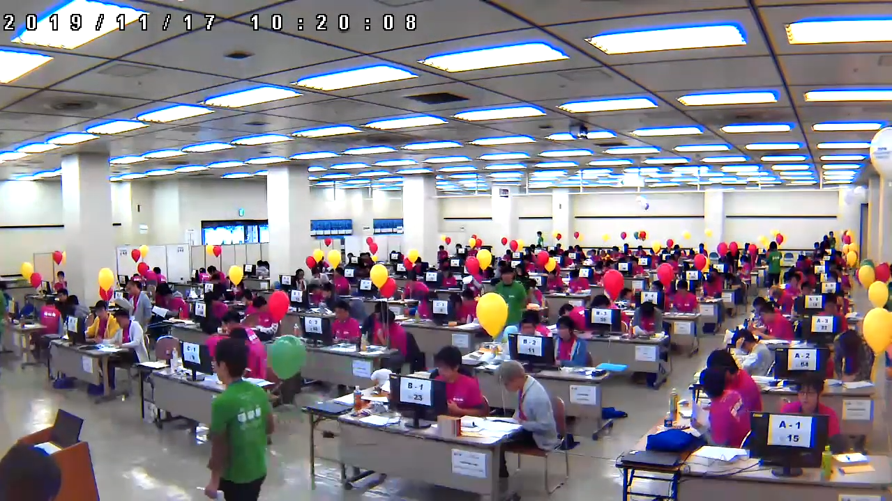

# ICPC へのお誘い

<span class="author">Asa</span>

## はじめに

こんにちは、第 3 期生の土屋です。
ネットでは「Asa (@a01sa01to)」として活動しています<span class="footnote"><s>ここまでの情報で私のフルネームと誕生日がわかるらしいですよ</s></span>。
2021 年 3 月に古河中等教育学校を卒業し、現在は埼玉大学工学部情報工学科に所属しています。
この度、細島部長にお声がけいただき、このような形で部誌の編集に携わることとなりました。

技術系（特にプログラミング関連）の記事がほとんどである、この部誌を読んでくださっている方の中には、「競技プログラミングについて聞いたことがある / すでに参加している」という方がいると思います。そこで、国際大学対抗プログラミングコンテスト（ICPC）に関する記事を書きたいと思います。

## ICPC ってなに？

国際大学対抗プログラミングコンテスト（International Collegiate Programming Contest・通称 ICPC）<span class="footnote">https://icpc.global/ （日本語版: https://icpc.iisf.or.jp/ ）</span> は、同じ大学の 3 人で 1 チームを作り、プログラミングの問題を解く大会です。中学生・高校生の皆さんは、「国際情報オリンピックのチーム参加版」と捉えていただけるとわかりやすいかもしれません。

{width=160}

この大会には世界各国から毎年 3 万人以上が参加しており、日本からも様々な大学から参加しています。2021 年度、私の所属する埼玉大学からも 2 チーム出場し、私もそのうちの 1 チームに参加していました<span class="footnote">ちなみに私のチームの結果は、予選 43 位、アジア地区大会 11 位でした。もう 1 チームは予選 104 位で、アジア地区大会に進出できませんでした。</span>。

大会の流れとしては、「国内予選 → アジア地区大会 → 世界大会」といった流れです。情オリに似ていますね。国内予選では 3 時間で 6-7 問、アジア地区大会では 5 時間で 10 問程度の問題を解きます。情オリとは違い、得点ではなく、解いた問題数で競います。また、アジア地区大会で利用できるコンピュータもチームで 1 台と制限があります<span class="footnote">2020 年度・2021 年度はオンラインだったため、1 人 1 台でした。なお国内予選では、コードではなく、自分のコンピュータで出た答えを提出します。<s>時間制限は実質無限です。</s></span>。そのため、1 人が解いている間にほかの人がアイデアを出すなどといったチームワークが重要になります。
さらに知りたい方は、ICPC 日本公式団体に掲載されている「3 分でわかる ICPC」（ https://icpc.iisf.or.jp/acm-icpc/3min/ ）も併せてご覧ください。

{width=400}

## どんな問題を解くの？

「○○ くらいの難易度です！」と言っても個人差があると思うので、実際に出された問題を見てみましょう。

### 2021 年度 国内予選 A 問題

https://icpc.iisf.or.jp/past-icpc/domestic2021/contest/all_ja.html#section_A より、問題文の概要を書いてみます。

> 4 つのお椀とその中に入ったビー玉がある。
> 1 つもビー玉が入っていないお椀があることがあるが、少なくともどれか 1 つのお椀にはビー玉が入っていることが保証されている。
>
> 4 つのお椀に対して、空でないお椀が 1 つだけになるまで、以下の操作を繰り返す。
>
> 1. 空でないお椀のうち、ビー玉が少ないものを選ぶ。2 つ以上あるときは、一番左のお椀を選ぶ。
> 2. 選んだお椀以外の、空でないすべてのお椀から、選んだお椀と同じ数のビー玉を取り除く。ただし、選んだお椀のビー玉はそのままにしておく。
>
> さて、最終的にお椀に残ったビー玉の個数はいくつ？

> 制約
>
> - それぞれのビー玉の個数は、0 個以上 100 個以下。
> - 少なくとも 1 つは 0 ではない。
> - データセットは 100 個以内。
> - `0 0 0 0` は終了の合図。

サンプルの入出力を見てみましょう。

```
10 8 4 6
0 21 7 35
5 45 13 3
52 13 91 78
0 0 0 0 （←入力終了の合図）
```

```
2
7
1
13
```

さて、この問題をあなたならどう解きますか？

<hr class="page-wrap" />

まず思いつくのは、単純にシミュレーションしてみることです。

具体的には、ビー玉の残ったお椀が 1 以下ではない限り、次の手順を繰り返します。

1. お椀を、ビー玉の個数でソートする
2. 一番少ないお椀を選び、そのビー玉の個数を他から減らす
3. ビー玉が 0 以下になったお椀を削除する

このような方法でも、計算量は高々 $O(T \sum a_i)$ （$10^4$ くらい）なので、高速です<span class="footnote">各手順で少なくとも 1 つは取り除かれるので、最大でビー玉の個数分の手順しか行われません。</span>。
なお、データセット数を $T$ としています。

```cpp:ans.cpp
#include <bits/stdc++.h>
using namespace std;

int main() {
  while (true) {
    vector<int> a(4);
    for (int i = 0; i < 4; ++i) cin >> a[i];

    if (a[0] + a[1] + a[2] + a[3] == 0) break;

    while (a.size() > 1) {
      sort(a.begin(), a.end());

      for (int i = 1; i < a.size(); ++i) a[i] -= a[0];

      auto itr = remove_if(a.begin(), a.end(), [](int x) {
        return x <= 0;
      });
      a.erase(itr, a.end());
    }
    cout << a[0] << endl;
  }
  return 0;
}
```

ICPC では、このような単純な繰り返し処理や条件分岐などができれば、チームに貢献できます。
実際、当時 AtCoder 茶色 の私でも、解くことができました。

---

参考までに、さらに高速な方法をご紹介します。それは、最大公約数を用いる方法です。

実は、それぞれのデータセットの答えは、 $a_1, ... , a_4$ の最大公約数になることが証明できます<span class="footnote">https://icpc.iisf.or.jp/past-icpc/domestic2021/commentaries.html#A</span>。

これを用いると、 $O(T \log(\min a_i))$ で計算できます。

```cpp:ans.cpp
#include <bits/stdc++.h>
using namespace std;

int main() {
  while (true) {
    int a, b, c, d;
    cin >> a >> b >> c >> d;

    if (a + b + c + d == 0) break;

    int g = a;
    g = gcd(g, b); g = gcd(g, c); g = gcd(g, d);

    cout << g << endl;
  }
  return 0;
}
```

---

### 2020 年度 アジア地区大会 A 問題

本当は 2021 年度の問題を載せようと思ったのですが、まだ公開されていませんでした...。（何かの体積を計算させる問題だったと記憶しています）

そこで、2020 年度の問題を載せます！<span class="footnote">https://icpc.iisf.or.jp/past-icpc/regional2020/problems-2020.pdf すべて英語です。本番では、機械翻訳は許されません（辞書は OK）。</span>

> $N \times N \times N$ の立方体に収まるある立体を、 $x-y$, $y-z$, $z-x$ 平面それぞれに射影した図が与えられます。
> 与えられた図に適する図形が存在するか判定してください。
>
> 制約: $1 \le N \le 100$

解法は、 $N \times N \times N$ すべてが埋まった立方体から、「削って」いき、最終的に出来上がった立体が、条件が満たしているかを確認する方法です。

アジア地区大会では、自分のコンピュータではなく、ジャッジ用コンピュータで正誤判定されるため、時間制限が定められています。
この問題では 2 秒ですが、以上の解法は $O(N^3)$ なので、AC になります。

実装は大変ですが、これも問題なく解けると思います。

```cpp:ans.cpp
#include <bits/stdc++.h>
using namespace std;
#define rep(i, n) for (int i = 0; i < (n); ++i)

int main() {
  int n;
  cin >> n;
  vector yz(n, vector<bool>(n)), zx(n, vector<bool>(n)), xy(n, vector<bool>(n));
  rep(i, n) {
    string s; cin >> s;
    rep(j, n) yz[j][n - i - 1] = (s[j] == '1');
  }
  rep(i, n) {
    string s; cin >> s;
    rep(j, n) zx[j][n - i - 1] = (s[j] == '1');
  }
  rep(i, n) {
    string s; cin >> s;
    rep(j, n) xy[j][n - i - 1] = (s[j] == '1');
  }

  vector ans(n, vector(n, vector<bool>(n, true)));
  rep(i, n) rep(j, n) if (!yz[i][j]) rep(k, n) ans[k][i][j] = false;
  rep(i, n) rep(j, n) if (!zx[i][j]) rep(k, n) ans[j][k][i] = false;
  rep(i, n) rep(j, n) if (!xy[i][j]) rep(k, n) ans[i][j][k] = false;

  rep(i, n) rep(j, n) {
    if (yz[i][j]) {
      bool chk = false;
      rep(k, n) if (ans[k][i][j]) chk = true;
      if (!chk) { puts("No"); return 0; }
    }
  }
  rep(i, n) rep(j, n) {
    if (zx[i][j]) {
      bool chk = false;
      rep(k, n) if (ans[j][k][i]) chk = true;
      if (!chk) { puts("No"); return 0; }
    }
  }
  rep(i, n) rep(j, n) {
    if (xy[i][j]) {
      bool chk = false;
      rep(k, n) if (ans[i][j][k]) chk = true;
      if (!chk) { puts("No"); return 0; }
    }
  }
  puts("Yes");
  return 0;
}
```

## 最後に

ICPC の問題を実際に見てみましたが、「こんなの解けるわけがない！」というものではなかったと思います。
むしろ、少し考えたうえで、プログラミングの初歩である「繰り返し処理」「条件分岐」を使いこなすだけで、最初の問題は解けます。

競技プログラミングをするうえで、ICPC は一生に 5 回程度しか参加できないため、貴重な体験になることは間違いないです。
そして ICPC は、プログラミング力ではなく、チームワークが鍵です。
チーム戦で生まれる連帯感というのは、なかなか体験できないと思います。

この記事を通じて、少しでも興味を持っていただけたのであれば幸いです。
大学に入学した際には、ぜひとも ICPC に参加してみてください！！！！
<span class="footnote">参加資格のない方は...順位表実況や過去問などでも楽しめます！</span>

最後までお読みいただき、ありがとうございました！
