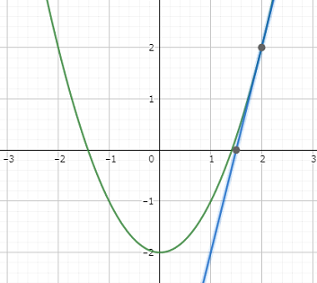
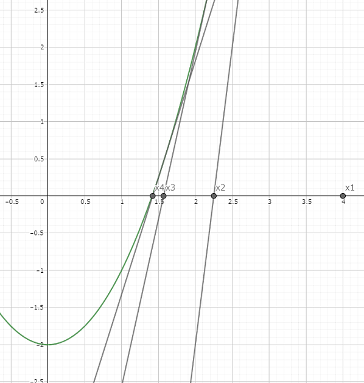
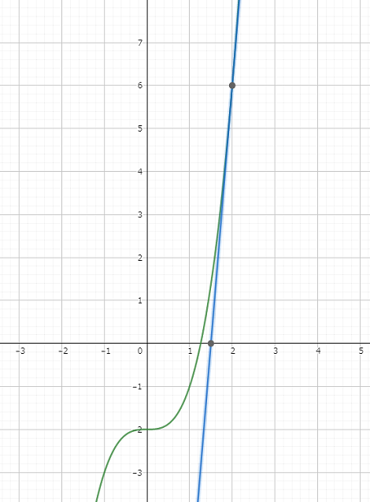

# ニュートン法で近似をしよう

## はじめに

世の中には、特別な記号を使わずして表すことのできない、多くの数が存在しています。
具体的に言うと、$\sqrt{2}$、$\log{2}$、$\pi$(円周率)、$e$(ネイピア数)などの無理数と呼ばれる数がそれにあたります。

そして、我々人間はその値がどの程度であるか確かめるために様々な方法でその値を近似してきました。具体的には、円周率を正多角形を用いて求めてみたり、不等式で値を概算してみたり、級数を用いたりなどです。

今回はそんな人間が生み出してきた近似方法の一つである、ニュートン法について焦点を当てて考えていこうと思います。

## ニュートン法とは

まず、ニュートン法の説明をします。ニュートン法とは、簡単に言うと接線を引きその交点を求めることによって、求めたい値を近似していく方法です。この時、接線の傾きを求める関係上、$f(x)$ は微分可能な関数でなくてはいけません。

厳密に言うと $f(x) = 0$ の解 (求めたい数) を接線を用いることによって近似します。ここで、$f(x)$ の接線を求めるために、求めたい数より大きな $x$ 座標全てで微分可能であることを前提とします。
最初の $x$ 座標を $x_1$ とし、最初の $y$ 座標を $f(x_1)$ とします。

<br />

---

一回目の操作の時、接線の傾きは $f'(x_1)$ で、これは点 $(x_1,f(x_1))$ を通るから接線の方程式は

$$
  y = f'(x_1)(x - x_1) + f(x_1)
$$

となる。

{width=300}

これを繰り返すことにより、$n$ 回目の接線の傾きは $f'(x_n)$、接点は点 $(x_n,f(x_n))$ であるから
$n$ 回目の接線の方程式は

$$
  y = f'(x_n) ( x - x_n ) + f(x_n)
$$

となる。

この時、$y = 0$ の時の $x$ 座標が $x_{n+1}$ となるので、$y = 0, x = x_{n+1}$ として移項すると

$$
  x_{n+1} = x_n - \frac{f(x_n)}{f'(x_n)}
$$

という式が得られる。

---

<br />

この式の $n$ を限りなく大きくすることによって得られる $x$ が答えとなります。

{width=300}

図からなんとなく収束していきそうな感じがしますが、証明によりきちんと値が収束することを示します。

証明を以下の 3 ステップで行います。

<br />

1. $\sqrt{a} < x_{n+1} < x_n$ を示す
   > $x_1 > \sqrt{a} > 0$（前提より）
   >
   > 数学的帰納法により $x_n > \sqrt{a}$を示す
   >
   > (1) $n = 1$のとき $x_1 > \sqrt{a}$
   >
   > (2) $n = k$のとき成り立つとすると $x_k > \sqrt{a}$
   >
   > $n = k+1$ のとき
   >
   > $$
   >   x_{k+1} = \frac{x_k^2 + a}{2x_k} > \frac{(a+a)}{2\sqrt{a}} = \sqrt{a} > 0
   > $$
   >
   > よって $n = k$ が成り立つとき、$n = k+1$ も成り立つ
   >
   > (1)(2) より全ての自然数 k において $x_n > \sqrt{a}$ が成り立つ
   >
   > ここで
   >
   > $$
   >   x_n - x_{n+1} = x_n - (\frac{x_n}{2} + \frac{a}{2x_n}) = \frac{x_n^2 - a}{2x_n}
   > $$
   >
   > $x_n > \sqrt{a}$ より、$x_n^2 - a > 0$
   >
   > 故に
   >
   > $$
   >  \frac{x_n^2 - a}{2x_n} > 0
   > $$
   >
   > したがって $x_{n+1} < x_n$
   >
   > よって
   >
   > $$
   >   \sqrt{a} < x_{n+1} < x_n
   > $$
2. $x_{n+1}-\sqrt{a} < \frac{1}{2}(x_n-\sqrt{a})$ を示す
   > $$
   >   \begin{eqnarray}
   >     \frac{1}{2}(x_n-\sqrt{a}) - x_{n+1} + \sqrt{a} &=& \frac{\sqrt{a}}{2} - \frac{a}{2x_n}\\
   >     &=& \frac{\sqrt{a}}{2x_n}(x_n-\sqrt{a})
   >   \end{eqnarray}
   > $$
   >
   > $x_n > \sqrt{a}$ より $\frac{\sqrt{a}}{2x_n}(x_n-\sqrt{a}) > 0$
   >
   > したがって
   >
   > $$
   >   x_{n+1}-\sqrt{a} <\frac{1}{2}(x_n-a)
   > $$
3. 極限値が $\sqrt{a}$ に収束することを示す
   > 2.で求めた不等式を繰り返すことにより
   >
   > $$
   >   \begin{eqnarray}
   >     x_n-\sqrt{a} &<& \frac{1}{2}(x_{n-1}-\sqrt{a})\\
   >     &<& (\frac{1}{2})^2(x_{n-2}-\sqrt{a})\\
   >     &<& \cdots < (\frac{1}{2})^{n-1}(x_1-\sqrt{a})
   >   \end{eqnarray}
   > $$
   >
   > $x_1 > \sqrt{a}$ より
   >
   > $$
   >   0 < x_n- \sqrt{a} < (\frac{1}{2})^{n-1}(x_1-\sqrt{a})
   > $$
   >
   > ここで
   >
   > $$
   >   \lim_{n \to \infty} (\frac{1}{2})^{n-1}(x_1-\sqrt{a}) = 0
   > $$
   >
   > はさみうちの原理により
   >
   > $$
   >   \lim_{n \to \infty} (x_n - \sqrt{a}) = 0
   > $$
   >
   > したがって
   >
   > $$
   >   \lim_{n \to \infty}x_n = \sqrt{a} \quad \blacksquare
   > $$

## プログラミングしてみよう！！

では、先ほどこの方法が成り立つことが確認できたのでプログラムによって再現していきましょう。今回は $\sqrt{2}$ の場合について作っていくことにします。

以下のプログラムは、すべて`C++`で記述されています。

さっそくですが、下のようなコードになります。

```cpp
// コード(cpp)
#include <bits/stdc++.h> // おまじない
using namespace std;

// プログラムのはじまり
int main() {
  double ans = 20;

  // 十分な回数(10000回)繰り返す
  for (int i = 0;i < 10000; i++) {
    // ニュートン法の式の通りに値を更新
    ans = ans -((ans*ans)-2)/(2*ans);

  }
  // 小数第15位までansの数字を表示する
  printf("%.15f\n",ans);

} // プログラムの終わり
```

これだけを見てもよく分からないと思うので補足をしてきます。

### ① プログラムの基本構造(C++)

プログラミング言語には日本語や英語と同じように文法が存在しており、一定の規則の上で書かなくてはいけません。下の部分はプログラムの開始、終了をコンピューターに伝える部分となっています。

```cpp
#include <bits/stdc++.h>
using namespace std;

int main() {

}
```

### ② 変数の宣言

今回扱う数字は実数なので、実数の変数を定義し、初期値(= x1)としておきます。

```cpp
double ans = 20;
```

これは $x_1＝20$ としています。また、この初期値は求めたい数より大きければどの数でもかまいません。（自然数に限らず、実数でも OK です。）

### ③ 繰り返し

`{}`で囲まれている部分を 10000 回繰り返します。

```cpp
for (int i = 0;i < 10000; i++) {

}
```

ちなみに下の場合は 10 回の繰り返しとなります。

```cpp
for (int i = 0;i < 10; i++) {

}
```

### ④ ニュートン法の計算部分

初めに、ほとんどのプログラミング言語における「=」は等式を意味しているものではなく、代入を意味します。例えば `a = 20` を例にとって考えてみます。数学では `a` と`20`は同じ値であるということを意味していますが、プログラミング言語では「変数`a`に`20`を**代入する**」ということを意味します。
また、掛け算の記号は `×` でなく `*` を、割り算の記号は `÷` でなく `/` を用います。

このプログラムでは、`ans`の値を更新していき、値を求めます。

### ⑤ 表示

10000 回計算が終わった後、ans の値を小数第 15 位まで表示して改行します。

```cpp
printf("%.15f\n",ans);
```

## 結果

前節で書いたプログラムの初期値を変えることによって値がきちんと求めることができるかと、収束のスピードを見ていきたいと思います。

また、収束したとは正確な値との差が非常に小さくなった時とします。
しかし、その差の基準はいったいどうすれば良いでしょうか？

まず、$x_k$ は常に求めたい数より大きくなる、また $n$ が増加するにつれて $x_k$ は小さくなって求めたい数に近づく、という二つの事象から次の $x_{k+1}$ との差が非常に小さいとき、ほとんど近似できた、すなわち、
$( x_k - x_{k+1} ) < \epsilon$ （$k$:自然数、$\epsilon$:計算精度を決める非常に小さな定数）を満たしたら近似できたということにしましょう。

ここで、1 回の計算にかかる時間はほぼ同じと言えるので、上記の条件式を満たすようになるまでに計算した回数が小さいほど収束が早いといえます。

近似できたのが何回目の操作であるかも表示するプログラムの一例を以下に示します。

```cpp
// コード(cpp)
#include <bits/stdc++.h> // おまじない
using namespace std;

// プログラムのはじまり
int main() {

  double ans = 20; // x1の値
  int i;

  // 十分な回数(10000回)繰り返す
  for(i = 0; i < 10000; i++){
    double tmp = ans;

    // ニュートン法の式の通りに値を更新
    ans = ans -((ans*ans) - 2)/(2*ans);

    // 差が0.0000001になったら計算終了
    if(tmp - ans <= 0.0000001) break;
  }

  // ansの値と誤差が小さくなった時のiを表示
  printf("%.15f\n%d\n",ans,i);

} // プログラムの終わり
```

このプログラムを用いることで、計算にかかった回数 = 速度が分かります。

| x₁ の値 | 計算した回数 |
| ------- | ------------ |
| 2       | 4            |
| 20      | 7            |
| 200     | 11           |
| 2000    | 14           |
| 20000   | 17           |
| 200000  | 21           |

初期値が求める値に近いほど収束するスピードが早いことが分かります。まあ、当たり前と言えばあたりまえなのですが。

例えば、ある初期値 $x_1$ によって得られる $x_2$ が別の初期値 $x'_1$ と同じになった時、単純に計算にかかる時間は 1 回分短くなります。

## 応用方法

実は、このニュートン法は $\sqrt{2}$ の時だけでなく、$\sqrt{n}$ ( $n$ は任意の正の実数)のときにも成り立ちます。

さらにいうと、これは 2 乗根の時だけではなく 1.5 乗根、3 乗根、4 乗根、...$m$ 乗根( $m$ は任意の正の実数)の時にもすべて成り立ちます。

これは、最初に求めた式 $x_{n+1}  =  x_n  - f( x_n) / f'( x_{n+1})$ をもとに、2 次式が成り立つことが分かります。

この式の $f(x)$ の次数を変えても、(例えば $f(x) = x^3 - 2$ のときでも)成り立ちます。

{width=250}

したがって、$\sqrt[k]{m}$ ( $k,m$ はともに任意の正の実数)の値も同様の方法で近似することができます。ニュートン法の式 $x_{n+1} = x_n - f( x_n) / f'( x_n)$ を用いることは変わらないので
$\sqrt[k]{c}$ を求める場合、$f(x) = x^k - c$ とおいて、少し変えると作ることが出来ます。

また、前節では調べる数字を $\sqrt{2}$ のみに絞って考えているため変数が少なかったのですが、ここで「何乗根であるか？」と「根の中の数字」を表す変数を追加し、新たにコードを書き直します。

コードは以下の通りになります。

```cpp
// コード(cpp)
#include <bits/stdc++.h> // おまじない
using namespace std;

// プログラムのはじまり
int main() {　

  double ans = 20; // 初期値
  double  k = 3;   // 何乗根か？
  double  c = 2;   // 根の中の数字は何か？

  // 十分な回数(10000回)繰り返す
  for (int i = 0;i < 10000; i++){

    // ニュートン法の式の通りに値を更新
    ans = ans -(pow(ans,k)-c)/(k*pow(ans,k-1));

  }

  // 小数第15位までansの数字を表示する
  printf("%.15f\n",ans);

} // プログラムの終わり
```

この時、$f'(x) = kx^{k-1}$ であるから、累乗をプログラムで表現する必要が出てきます。
そこで、$a^b$ を `pow(a,b)` という標準の関数で計算します。

次節では収束条件とその証明を書きます。

## 収束条件とその証明

> **収束条件**：
> $f(x_0) > 0、f(a) < 0、f'(x) > 0、f''(x) > 0$ の全てを満たす。

すなわち、$x$ についての閉区間 $[a,x_0]$ において $f(x)$ が下に凸な単調増加なグラフであり、$f(x) = 0$ を満たす解が一つある状態です。

<hr class="page-wrap" />

> **証明**
>
> $x$ が区間 $[a,x_0]$ にある時、$f''(x) > 0$ より
> $$\int_{x}^{x_0}f''(x)dx > 0$$
> が成り立つ。
>
> 計算し、式を変形すると　$f'(x) < f'(x_0)$ したがって
> $$\int_{x}^{x_0}f'(x)dx < \int_{x}^{x_0}f'(x_0)dx $$
> が成り立つ。
>
> 計算すると
> $$f(x_0) - f(x) < f'(x_0)(x_0-x)$$
>
> ここで $f(a) < 0 < f(x_0)$ が成り立つから中間値の定理より
> $f(\alpha) = 0$ を満たす $\alpha$ が区間 $(a,x_0)$ に存在する。
>
> また、関数 $f(x)$ は単調増加関数であるから、逆関数が存在する。
> （区間 $[a、x_0]$ において $f(k) = f(l)$ でかつ $k\neq l$ を満たす数が存在しないものを逆関数という。）
>
> よって　$f^{-1}(x)$ を $f(x)$ の逆関数とすると　$\alpha = f^{-1}(0)$ と表せる。
>
> ここで $x = \alpha$ とおくと
> $$f(x_0)-f(\alpha) < f'(x_0)(x_0-\alpha)$$
>
> ここで $f(\alpha) = 0, f'(x) > 0, f(x_0) > 0$より
> $$\alpha < x_0 - \frac{f(x_0)}{f'(x_0)} < x_0$$
>
> また、$x_0 - f(x_0)/f'(x_0) = x_1$ より
> $$\alpha < x_1 < x_0$$
>
> これを繰り返すことによって $\alpha < \cdots < x3 < x2 < x1$
>
> また、$x$ は単調減少であり下限があるため数列 $\{x_n\}$ は収束する。ここで数列 $\{x_n\}$ が $\beta$ に収束するとする。
>
> $x_{n+1} = x_n - f(x_n) / f'(x_n)$ より
>
> $$\lim_{n \to \infty} x_{n+1} = \lim_{n \to \infty}(x_n - \frac{f( x_n)}{f'( x_n)})$$
>
> ここで $\lim_{n \to \infty}x_n = \beta, \lim_{n \to \infty}x_{n+1} = \beta$ であるから
> $$\beta = \beta - \frac{f(\beta)}{f'(\beta)}$$
>
> これより $f(\beta) = 0$
>
> 関数 $f(x)$ は逆関数を持つため $\beta = f^{-1}(0)$
> よって
> $$\beta = \alpha \quad (\because \alpha = f^{-1}(0))$$
>
> したがって、数列 ${x_n}$ は $\alpha$ に収束し、$f(\alpha) = 0$ となるので
>
> ニュートン法の数列 ${x_n}$ は「 $f(x_0) > 0, f(a) < 0, f'(x) > 0, f''(x) > 0$ の全てを満たす」とき
> $f(x) = 0$ の解 $\alpha \quad (a < \alpha < x_0)$ に収束する。$\quad \blacksquare$

## おわりに

プログラミングと聞くと、難しくて初心者にはできないものだと考えてしまうかもしれませんが、この記事のように簡単な計算や、文字を表示させるなど、単純な動作だけなら今すぐにでも実装・実行できます。

それに、今の時代コンパイラはオンライン上のものを使うこともでき、インターネットで検索すれば実装方法も簡単に見つけることができますし、自分でアレンジすることができます。

ぜひ、皆さんも簡単なプログラムから初めて、自分の作りたいものを作りましょう！

## 参考文献等

1. ニュートン法 wikipedia  
   https://ja.wikipedia.org/wiki/ニュートン法
2. ニュートン法とは？ ～定義と性質～ - 理数アラカルト  
   https://risalc.info/src/newtons-method-properties.html
3. グラフ作成 Geogebra  
   https://www.geogebra.org/calculator
4. 今回使用したオンラインコンパイラ : paiza.io  
   https://paiza.io/ja
