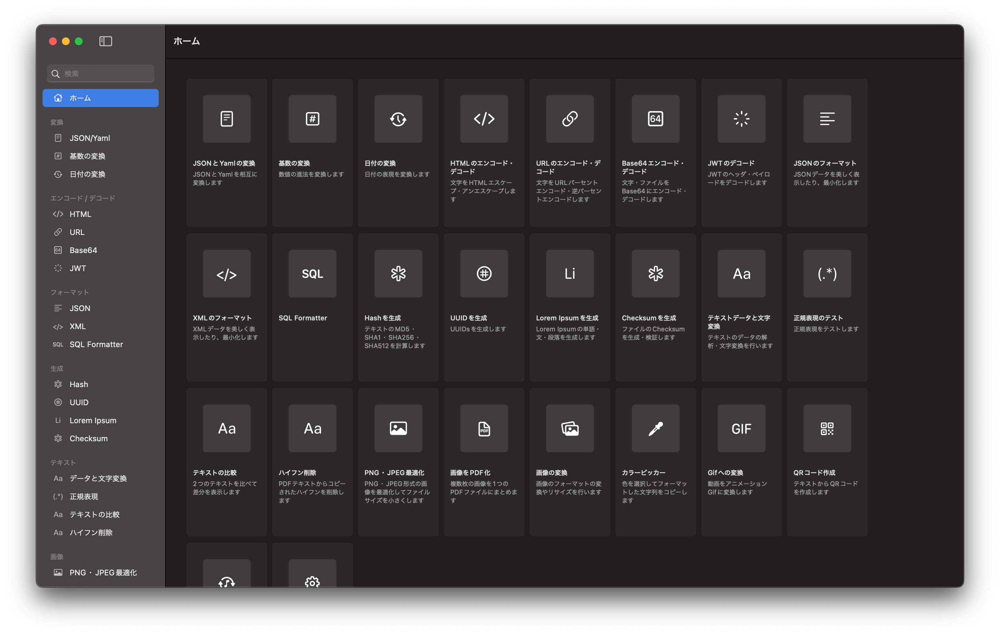

# おすすめソフト

### DevToys

デベロッパーのための便利箱的なソフト。JSON/Yaml・日付・基数(2 進数,16 進数など)変換、HTML・URL エンコード/デコード、Hash や UUID の生成、正規表現、画像最適化/変換、QR コード生成、音声フォーマット変換などが可能。すばらしいので今すぐインストールしましょう。

Windows 版が公式で、mac 版は有志によって開発されています。更なる詳細は公式サイトや[こちら](https://qiita.com/danishi/items/2de6a4ab028d27a8f4ab)からどうぞ！

- [公式サイト](https://devtoys.app/)
- [Windos 版ダウンロード](https://apps.microsoft.com/store/detail/devtoys/9PGCV4V3BK4W?hl=ja-jp&gl=JP)
- [mac 版ダウンロード](https://github.com/ObuchiYuki/DevToysMac/releases/tag/0.0.10)
